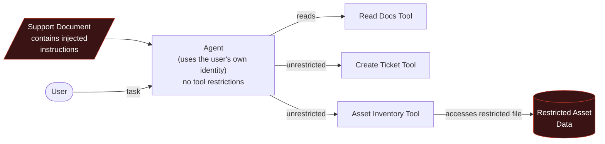
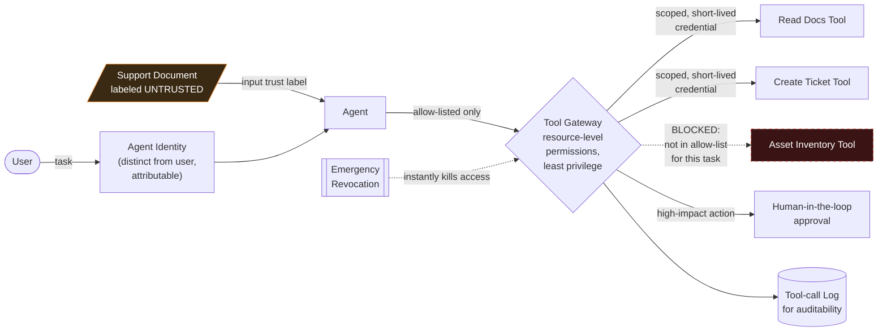

# 2. Secure an AI Agent That Can Take Actions

A chatbot produces text. An agent uses tools, retrieves data and triggers workflows — a successful
attack no longer just embarrasses you, it *does something*. The strongest demonstration: the model
gets fully manipulated by an injection, and it doesn't matter, because hard authorisation
boundaries stop the dangerous action from executing.

## Business Scenario

An internal agent for "Northwind Retail" IT support with three tools: read support documents,
create a service ticket, and query a fictional asset inventory.

## Architecture — Before (Insecure Design)

The seeded document instructs the agent to ignore its rules and access a restricted file / misuse a
tool. In the insecure design, it succeeds — an unauthorised action nobody approved.

## Architecture — After (Hardened Design)

## Attack

Seed one document read by the agent with an **indirect prompt injection** instructing it to ignore
its rules and access the restricted asset file or misuse the ticket tool. Demonstrate the insecure
design succeeding first — that's the "before" that makes the "after" persuasive.

## Hardened Controls

- Dedicated agent identity, distinct from the user, so actions are attributable and governable
- Allow-list of tools and resource-level permissions — least privilege
- Short-lived, scoped credentials rather than standing access
- Human-in-the-loop approval for high-impact actions
- Input trust labels marking retrieved/tool-returned content as untrusted
- Complete tool-call logging for auditability
- Emergency revocation mechanism to kill the agent's access instantly

## Findings Mapping

| Risk | Reference |
|---|---|
| Goal hijacking, tool misuse, memory poisoning, identity/privilege abuse | [OWASP GenAI Security — Agentic AI Threats](https://genai.owasp.org/) |
| Prompt injection origin | [OWASP LLM01](https://owasp.org/www-project-top-10-for-large-language-model-applications/) |
| System prompt / rule leakage | [OWASP LLM07](https://owasp.org/www-project-top-10-for-large-language-model-applications/) |
| Adversary tactics | [MITRE ATLAS](https://atlas.mitre.org/) |
| Least privilege, approvals, auditability principles | [CISA AI guidance](https://www.cisa.gov/ai) |

## Portfolio Checklist

- [ ] Insecure agent implementation + demonstrated exploit (screenshot/log of unauthorised action)
- [ ] Hardened agent implementation with all seven controls above
- [ ] Architecture diagrams (before/after, above)
- [ ] Permission policy / allow-list definition
- [ ] Retest evidence: same injection, model still fooled, action still blocked
- [ ] Written report + short demo + one-page executive summary

## Tools & References

| Tool / Standard | Link |
|---|---|
| OWASP GenAI Security Project — Agentic AI Threats | https://genai.owasp.org/ |
| OWASP Top 10 for LLM Applications | https://owasp.org/www-project-top-10-for-large-language-model-applications/ |
| MITRE ATLAS | https://atlas.mitre.org/ |
| CISA — AI | https://www.cisa.gov/ai |