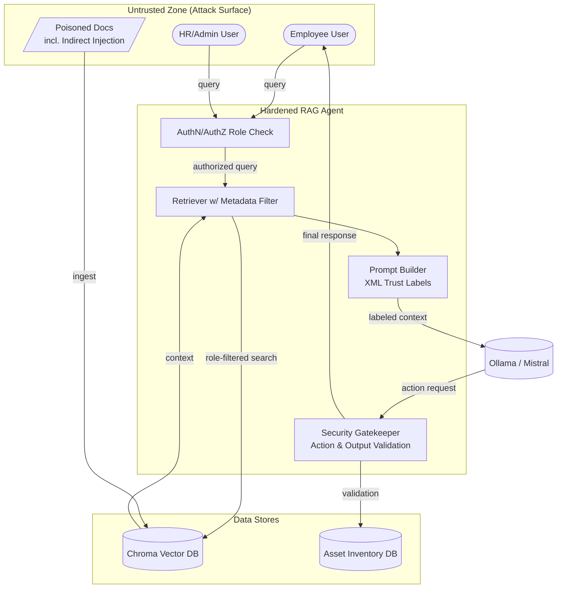

# Secure RAG Application

A small demo of a hardened Retrieval-Augmented Generation (RAG) setup designed to show how access control, metadata filtering, and output validation can reduce risky behavior in an AI application.

This project simulates a security-aware RAG agent that:
- verifies user identity and permissions before allowing a query
- filters search results using role-aware metadata
- labels retrieved content before sending it to the model
- checks model-suggested actions and outputs before returning them to the user
- stores trusted asset data in a local inventory for validation

## Architecture Overview



## What This Project Demonstrates

This repository is intended as a security-focused learning project for a RAG application. It is not a production-grade enterprise system, but it illustrates the following ideas:

- Principle of least privilege for users and actions
- Role-based filtering of retrieval results
- Guardrails around AI-generated actions and responses
- Trust boundaries between untrusted content and trusted system logic
- Why metadata and validation are important in AI workflows

## Prerequisites

Before running the app, make sure you have:

- Python 3.10+
- pip
- Ollama installed and running locally
- A model available in Ollama, such as `mistral` or another compatible LLM
- Optional: a virtual environment tool such as `venv` or `conda`

## Project Structure

Typical project layout:

```bash
03-secure-rag-application/
├── app/
│   ├── main.py
│   ├── auth.py
│   ├── retriever.py
│   ├── prompt_builder.py
│   ├── gatekeeper.py
│   └── config.py
├── data/
│   ├── docs/
│   └── inventory.json
├── requirements.txt
├── .env.example
├── README.md
└── run.sh
```

Exact files may vary depending on the project version, but the application generally includes:
- the retrieval layer
- auth and role checks
- LLM call logic
- security gate validation
- sample inputs or documents

## Setup

1. Open a terminal in the project folder:

```bash
cd "C:\Users\mihir\OneDrive\Documents\AI-Security-Projects\03-secure-rag-application"
```

2. Create and activate a virtual environment:

```bash
python -m venv .venv
```

On Windows PowerShell:

```powershell
.\.venv\Scripts\Activate.ps1
```

On Windows Command Prompt:

```cmd
.venv\Scripts\activate.bat
```

3. Install dependencies:

```bash
pip install -r requirements.txt
```

4. Start Ollama and confirm the model is available:

```bash
ollama pull mistral
ollama list
```

If your app is configured for a different model, update the config file accordingly.

5. Copy environment settings if needed:

```bash
copy .env.example .env
```

Then check that the required values are set correctly.

## How to Run

Depending on the project implementation, you may run the app using:

```bash
python app/main.py
```

or:

```bash
python -m app.main
```

or, if there is a startup script:

```bash
bash run.sh
```

After startup, the app should prompt you for a query or open a local interface. Use the app with a normal user role and then compare the behavior with a privileged user role.

## Example Usage

Try these sample prompts:

- "What are the office Wi-Fi instructions?"
- "Show me the HR policy for payroll retention."
- "Can you update the asset inventory for the server room?"

Expected behavior:
- normal employees should only see data they are allowed to access
- admin/HR roles may access a broader set of documents
- the app should block or sanitize unsafe actions
- responses should be filtered or refused when they conflict with security policy

## What to Expect

When the application runs, you should see a flow like this:

1. User submits a question
2. Authentication and authorization check occurs
3. The retriever searches only approved data for that role
4. The prompt is enriched with trust-aware labels
5. The LLM answers using trusted, filtered context
6. The gatekeeper validates output and any action requests
7. Only safe, policy-compliant responses are returned

The app is designed to demonstrate both the value of secure RAG design and the risks of unsafe document ingestion and unfiltered model output.

## Security Notes

This project intentionally includes attack scenarios such as:
- poisoned or malicious documents
- indirect prompt injection
- unsafe action generation by the model
- missing validation between model output and system actions

It is meant for research, learning, and controlled demos. Do not use it in production without additional hardening, testing, and review.

## Troubleshooting

Common issues:

- Ollama is not running: start the Ollama service or daemon
- Model not found: run `ollama pull <model-name>`
- Missing dependencies: reinstall with `pip install -r requirements.txt`
- Authentication errors: verify your role configuration in local settings or config files
- No results returned: check that your vector database has been populated with sample documents

## License

This project is intended for educational and demonstration use. Add a license file if you plan to share or distribute it more broadly.

## Next Steps

Possible enhancements:
- add a real user identity provider
- integrate RBAC policies with a database
- add stronger prompt-injection detection
- add automated security tests
- deploy behind a secure API layer

This README is a practical starter guide for running and understanding the secure RAG demo.

