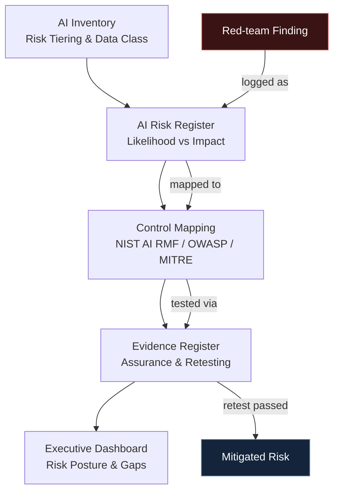

# AI Security and Governance Assurance System

This project is a functional **Governance, Risk, and Compliance (GRC)** platform specifically designed for AI systems. It bridges the gap between technical security findings (Red-Teaming) and executive-level business decisions.

---

## 🚀 Business Scenario

**"AI Security Lab"** operates four critical AI systems:

- **HR Employee Chatbot:** Handles internal PII and HR queries.
- **Customer Support Assistant:** Integrated with Zendesk and Salesforce (Public-facing).
- **DevSecOps Coding Agent:** Self-hosted model with access to proprietary code.
- **Credit Decision Model:** Critical financial model subject to fair lending regulations.

---

## 🛠️ Architecture & Flow

The system follows a **closed-loop remediation lifecycle**:



---

## 🌟 Key Features

- **The Traceability Thread:** A step-by-step lifecycle view showing how a technical vulnerability (e.g., Indirect Prompt Injection) is mapped to a NIST control, verified through evidence, and closed as a managed risk.
- **Dynamic Executive Dashboard:** High-level metrics for leadership including Risk Heatmaps and Control Coverage percentages.
- **Framework Alignment:** Direct mapping to:
  - NIST AI RMF 1.0 & AI 600-1 (Generative AI Profile)
  - OWASP Top 10 for LLM Applications
  - MITRE ATLAS (Adversarial Threat Landscape for AI Systems)
- **JSON-Based Persistence:** A lightweight "database" structure allowing for easy auditing and data portability.

---

## 📂 Project Structure

```text
├── app.py              # Streamlit Dashboard & UI
├── data_manager.py     # Database logic & Initialization
├── data/               # Persistent JSON Store
│   ├── inventory.json  # System details & Risk tiers
│   ├── risks.json      # Likelihood/Impact & Status
│   ├── controls.json   # NIST/OWASP/MITRE mapping
│   └── evidence.json   # Retest logs & Artifact links
└── requirements.txt
```

---

## 🚦 Getting Started

### Prerequisites

- Python 3.8+
- pip

### Installation

1. **Clone the repository:**

   ```bash
   git clone https://github.com/mihirhbhatt/Ai-Security-Projects/05-ai-governance-assurance.git
   cd ai-governance-system
   ```

2. **Install dependencies:**

   ```bash
   pip install streamlit pandas plotly
   ```

3. **Run the application:**

   ```bash
   streamlit run app.py
   ```

---

## 📊 Portfolio Checklist Achievement

- [x] AI inventory covering all 4 fictional systems with data classification.
- [x] Risk register containing findings traced from technical labs.
- [x] Control mapping (Internal Control ↔ NIST AI RMF ↔ OWASP LLM ↔ MITRE ATLAS).
- [x] Evidence register showing the "Post-Remediation Retest" status.
- [x] Executive dashboard summarizing risk posture via heatmaps.
- [x] Full traceability thread documented end-to-end.

---

## 📚 Tools & References

| Standard          | Focus Area                              |
| ----------------- | --------------------------------------- |
| NIST AI RMF       | Governance & Risk Management Frameworks |
| NIST AI 600-1     | Generative AI Specific Controls         |
| OWASP LLM Top 10  | Technical Vulnerability Categories      |
| MITRE ATLAS       | Adversarial Tactics & Techniques        |

---

*Developed as part of the AI Security Portfolio to demonstrate the intersection of Technical Security and Enterprise Governance.*